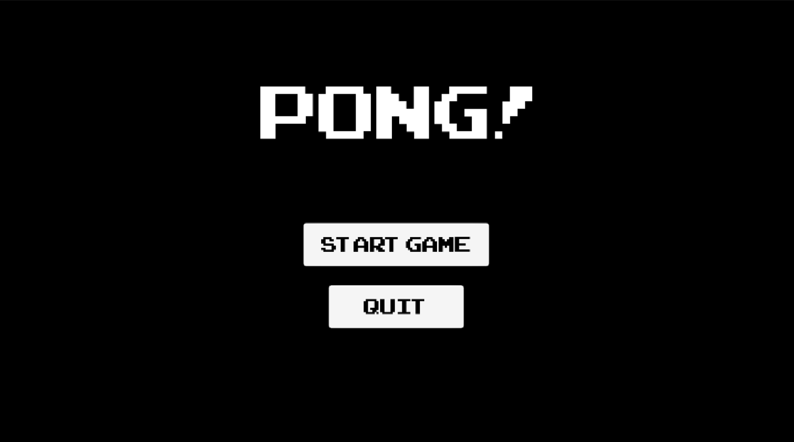
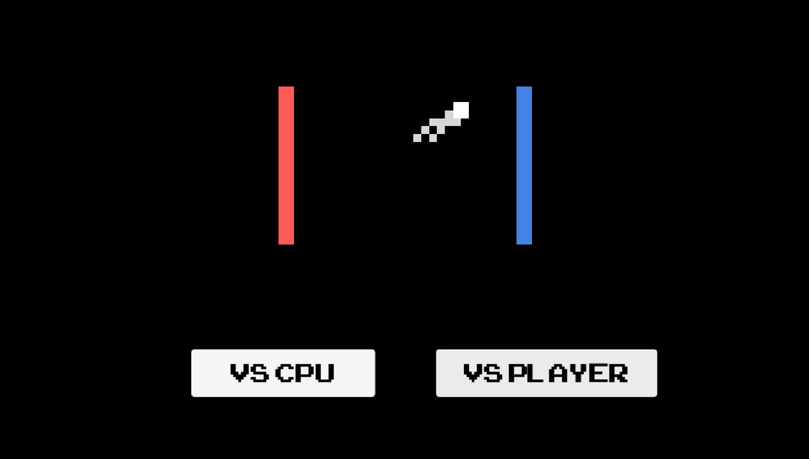
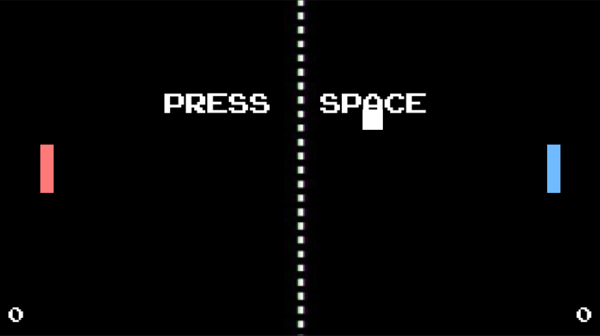
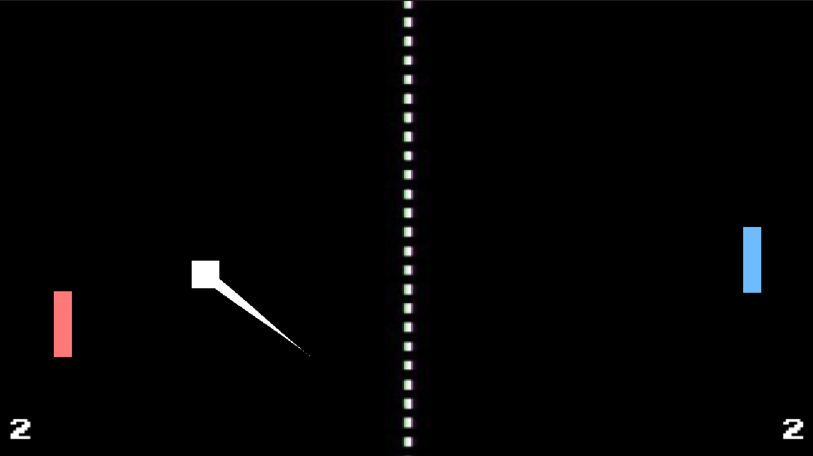

# Pong Game

## About
Welcome to the classic Pong game! This version of Pong offers two exciting gameplay modes:
- **Single Player**: Play against a challenging **CPU opponent**.
- **Multiplayer**: Compete against a friend in local multiplayer mode.

As you play, the **ball** gradually **increases its speed** with **each hit**, making the game progressively more challenging and exciting. The game is designed to provide a nostalgic yet thrilling experience for all players.

To enhance the nostalgic feel, the game features classic **background audio** that takes you back to the **golden age** of **arcade gaming**.

Each match is a race to **3 points**. The first player to reach 3 points wins the game, adding to the competitive spirit and excitement.

## Screenshots

  
  

## Instructions to Start the Game
1. Open Unity.
2. Navigate to the `Scenes` folder.
3. Open the `GameStart` scene.
4. Press the Play button in Unity to start the game.

## Controls
- **Player 1**: Use `W` and `S` keys to move up and down.
- **Player 2**: Use `UpArrow` and `DownArrow` keys to move up and down.

 
 
 

*Firdavsbek Ismoilov*